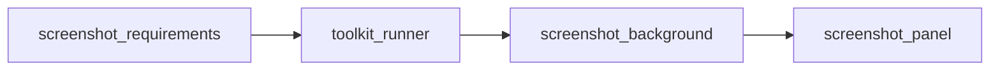

# Screenshot workflow — multi-agent overview

The monolithic **`screenshot_designer`** agent is replaced by three specialized agents orchestrated from **[`CLAUDE.md`](../../../../CLAUDE.md)**. There is **no separate Director agent**; the user may still ask for a **full-strip** `render_preview` + critique during the Panel phase.

## Flow

1. **`screenshot_requirements`** — **`python toolkit/scripts/layout.py`** only (no Web UI): go-ahead, device platform, pack, **`store-json`** / **`load-frame`**, user confirmations, seed **`datasource/temp/design_brief.json`** (`requirements`).
2. **`toolkit_runner`** — Python **`toolkit`** scripts, Node/`web_ui`, Vite on port **4713** (**after** requirements, **before** any designer HTTP work).
3. **`screenshot_background`** — First designer action: **`python toolkit/scripts/designer.py handoff`**; named background preset; theme-derived **`set_background`**; full-strip previews until **`background.user_approved`**; update Brief.
4. **`screenshot_panel`** — Lock typography (**Step 6**), compose **panel-by-panel** with **`render_panel_preview`** as default preview; conversational **“proceed to next panel?”** gates; **`explicit user command wins`**.

## Paths

| Path | Purpose |
|------|---------|
| [`datasource/temp/design_brief.json`](../../../../datasource/temp/design_brief.json) | Mergeable JSON between agents (gitignored like other temp files; see [.gitignore](../../../../.gitignore)) |
| `datasource/temp/*.png` | Preview images from `pull-preview` |
| `datasource/temp/*.json` (other) | Intermediate API payloads not yet merged into the brief |

Schema: **[`screenshot_design_brief.md`](screenshot_design_brief.md)**

## Who runs `designer handoff`?

**`screenshot_background`** runs **`python toolkit/scripts/designer.py handoff`** (publisher root) **after** **`toolkit_runner`** has the Web UI up. It should merge **`requirements.handoff_ok`** / **`requirements.web_ui_status`** (or equivalent) into **`datasource/temp/design_brief.json`** on success. **`screenshot_requirements`** does **not** call the designer.

## Shared tooling rules

**[`screenshot-tooling-rules.md`](screenshot-tooling-rules.md)** — CLI boundary, layout vs designer, layer IDs.

## Toolkit reference

- **`toolkit/SKILL.md`**
- **`toolkit/references/screenshot-designer-toolkit-reference.md`**

## Docs skill

This file is part of the **`.claude/skills/screenshot-docs/`** skill — start from [`../SKILL.md`](../SKILL.md) for the index.
