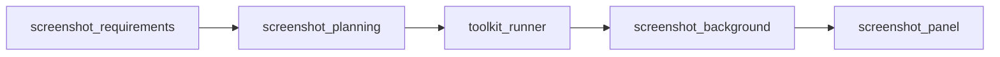

# Screenshot workflow — multi-agent overview

Specialized agents orchestrated from **[`CLAUDE.md`](../../../../CLAUDE.md)** and **[`.claude/workflows/mobile-publisher-workflow.md`](../../../workflows/mobile-publisher-workflow.md)**. There is **no separate Director agent**; full-strip **`render_preview`** may still run during the Panel phase per **`phase-panel.md`**.

## Flow

1. **`screenshot_requirements`** — **`python toolkit/scripts/layout.py`** only (no Web UI): go-ahead, device platform, pack, **`store-json`** / **`load-frame`**, user confirmations, seed **`requirements`** in **`datasource/temp/design_brief.json`**.
2. **`screenshot_planning`** — **No** Web UI / **`designer.py`**: creative **`creative_plan`** (background intent + per-panel layers / **`looks_like`** + optional per-layer **`layout`**); reads **`datasource/few_shots/*.md`** pattern files (exclude `README.md`, `_TEMPLATE.md`) for composition vocabulary; **user approves** **`creative_plan.user_approved`** here only.
3. **`toolkit_runner`** — Python **`toolkit`**, Node/`web_ui`, Vite on port **4713** (**after** planning is approved, **before** designer execution).
4. **`screenshot_background`** — **`designer.py handoff`**; **`set_background`** from **`creative_plan`** + theme (**full auto** after plan lock — no proceed gates; previews saved under **`datasource/temp/`**).
5. **`screenshot_panel`** — Typography lock + **`creative_plan.panels`** in order (**full auto**; user only on errors).

## Paths

| Path | Purpose |
|------|---------|
| [`datasource/temp/design_brief.json`](../../../../datasource/temp/design_brief.json) | Mergeable JSON between agents |
| [`datasource/few_shots/`](../../../../datasource/few_shots/) | Layout-only pattern `*.md` for **screenshot_planning** (exclude `README.md`, `_TEMPLATE.md`) |
| `datasource/temp/*.png` | Preview images from `pull-preview` |
| `datasource/temp/*.json` (other) | Intermediate API payloads |

Schema: **[`screenshot_design_brief.md`](screenshot_design_brief.md)**

Phase references: **`phase-requirements.md`**, **`phase-planning.md`**, **`phase-background.md`**, **`phase-panel.md`**.

## Who runs `designer handoff`?

**`screenshot_background`** runs **`python toolkit/scripts/designer.py handoff`** after **`toolkit_runner`** has the Web UI up. It merges **`requirements.handoff_ok`** / **`requirements.web_ui_status`** into the brief on success. **`screenshot_requirements`** and **`screenshot_planning`** do **not** call the designer.

## Shared tooling rules

**[`screenshot-tooling-rules.md`](screenshot-tooling-rules.md)** — CLI boundary, layout vs designer, layer IDs.

## Toolkit reference

- **`toolkit/SKILL.md`**
- **`toolkit/references/screenshot-designer-toolkit-reference.md`**

## Other skills

- **`.claude/skills/publisher-toolchain/`** — install / server matrix for **`toolkit_runner`**
- **`.claude/skills/aso-store-metadata/`** — store JSON playbook (**`app_optimizer`**)

## Docs skill

This file is part of the **`.claude/skills/screenshot-docs/`** skill — start from [`../SKILL.md`](../SKILL.md) for the index.
