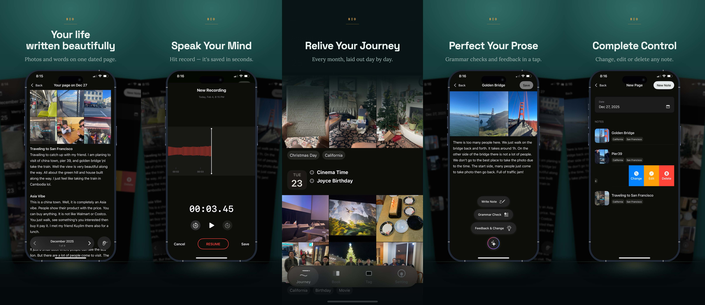
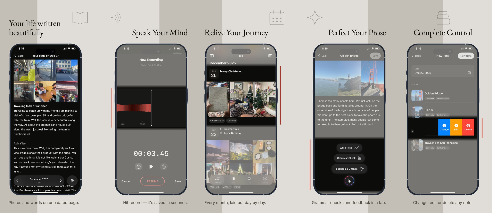
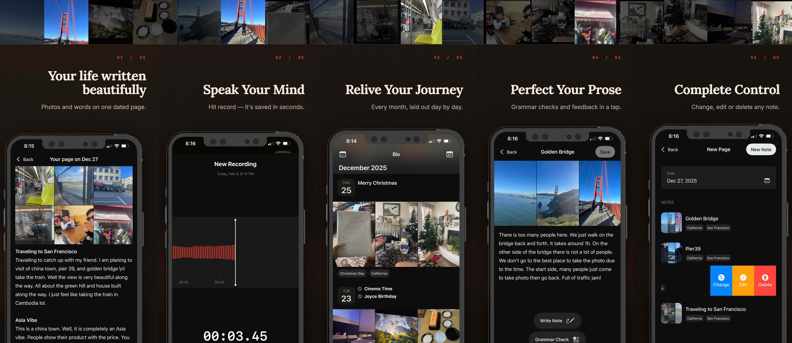

# design_ss

**Design App Store and Play Store screenshot strips with an AI agent.**







Give it your app's description and a folder of screen captures. An agent reads
them, designs the strip, and renders it at the exact size the stores require.

**Three runs, one `input/` folder, three designs.** The concept is chosen fresh
each time — palette, typeface, rhythm, how the devices sit — so a run you do not
like is a run away from one you do.

A strip is **one HTML document**. `strips/<target>/strip.html` is the single
source of truth — the renderer exports that file and the visual editor edits
that file, in the same browser engine. There is no second representation.

```
input/app.md          ┐                  ┌─ strips/<target>/strip.html
input/<target>/*.png  ┴─►  the agent  ─►─┤
                                         └─ strips/<target>/rendered/*.png
                                                    ▲
                                       strip_editor ┘  (optional, by hand)
```

Five targets: `iphone` and `ipad` for the App Store, `phone`, `tablet_7` and
`tablet_10` for Play Store.

| Target | Screenshot | Store |
| --- | --- | --- |
| `iphone` | 1290 × 2796 | App Store |
| `ipad` | 2048 × 2732 | App Store |
| `phone` | 1080 × 1920 | Play Store |
| `tablet_7` | 1200 × 1920 | Play Store |
| `tablet_10` | 1600 × 2560 | Play Store |

One panel is one screenshot at these dimensions; a five-panel iPhone strip is
6450 px wide. The two Apple sizes are specifications — Apple publishes exact
export sizes and rejects anything else. The Play sizes are house choices inside
Google's permitted range (320–3840 px per side, at most 2:1). All five are
declared in `strip_editor/src/editor/devices.ts`.

## Requirements

| | |
| --- | --- |
| **Node 22.x** | the renderer and the editor |
| **Chromium** | `npx playwright install chromium` — headless export |
| **An agent** | anything that reads `AGENTS.md`: Claude Code, Gemini CLI, Codex, Open Code, Co-Pilot, Cursor...etc |

```bash
git clone https://github.com/MeasnaLazi/design_ss.git
cd design_ss/composer
npm install
npx playwright install chromium
```

That is everything needed to design and render. The visual editor installs
separately and only if you want it.

## Running the agent

**The designer is the agent.** 

**1. Put your captures in `input/<target>/`,** named for what they show.
`timeline.png` tells the agent what that screen proves; `IMG_4821.PNG` tells it
nothing. Five or more is comfortable.

**2. Write `input/app.md`.** The whole gate is a name and a summary:

```markdown
# Bio

## Summary

A private journal that turns everyday moments into a story worth keeping.
For people who want to write a little, not a lot.
```

Everything else — tone, palette, device frame, panel count, the headlines
themselves — is optional, and anything you leave out the agent works out and
tells you what it chose.

**3. Start your agent in the repo root** and ask for a strip:

> can you design the screenshot?

> design the iphone strip

`CLAUDE.md` / `GEMINI.md` / `AGENTS.md` all point at the skill. From there the
run is: read the brief → draft any panel copy you did not write, back into
`app.md` → choose a concept and say it → write the HTML → check the schema →
render → look at the PNGs → iterate. Roughly four rounds, then it stops.

Name no target and it designs **every** device folder you have populated, as one
family rather than five cousins. It announces the set before the first write.

It will draft your marketing copy. It will not invent your app: every claim has
to be visible in a capture or supported by your summary.

## `input/` — what you write

```
input/
  app.md              the app: name, summary, request, pinned values, panel copy
  *icon*.png          your app icon — optional
  iphone/             one folder per target; the folder name IS the target
    welcome.png
    timeline.png
```

`app.md` has four sections, three of them optional: `# Name` and `## Summary`
(required), `## Request` for intentions written as prose — *"premium and quiet,
not a productivity app"* — `## About` for pinned values like `theme:` and
`frame:`, and `## Panel N` for copy you want taken verbatim. Panels you skip are
drafted and written back into this file, so the next run starts from copy you
have had a chance to correct.

→ **[`input/README.md`](input/README.md)** is the full format: every key, the
five target sizes, sharing one design across targets with `follows:`, and what
happens when you have more captures than panels.

## `strips/` — what comes out

```
strips/iphone/
  strip.html          the document — the single source of truth
  screenshots/        the captures it used, copied in
  images/             artwork made for it
  rendered/           panel0.png … panel4.png, strip.png, strip-data.json
```

Self-contained: a strip never references anything outside its own folder, so it
can be moved or cloned whole.

**`strips/` is output and is gitignored.** A run replaces the target folder
outright, and a run is not deterministic — the design decisions live in the
agent, not in `app.md`, so re-running the same input gives you a *different*
strip rather than the same one back. Copy a folder somewhere else if a
particular result is worth keeping.

## `strip_editor` — the parts you want to move yourself

```bash
cd strip_editor
npm install
npm run dev          # http://localhost:4714
```

Opens `strip.html` directly — no import step, nothing converted. Drag and resize
blocks with snapping, edit text in place, swap screenshots and device poses,
tune type and colour, undo anything. Saves are surgical: moving one headline
rewrites one line and leaves the rest of the file byte-for-byte alone.

It watches the file while the agent writes, so you can leave it open during a
run and watch the design appear — the canvas goes read-only and names whoever
holds it, and the lease lapses on its own if the run dies.

→ **[`strip_editor/README.md`](strip_editor/README.md)** for the full editor,
its keyboard map, the server API and the architecture notes.

## Read more

| | |
| --- | --- |
| [`AGENTS.md`](AGENTS.md) | the agent entry point — start an agent here |
| [`skills/strip-design/SKILL.md`](skills/strip-design/SKILL.md) | how a design run works, and the rules learned from real failures |
| [`skills/strip-design/archetypes.md`](skills/strip-design/archetypes.md) | the design vocabulary — the authority on anything visual |
| [`composer/README.md`](composer/README.md) | the renderer, the schema checker, and the frame packs |
| [`composer/strip-schema.md`](composer/strip-schema.md) | the markup contract a strip has to satisfy |
| [`NOTES.md`](NOTES.md) | non-obvious logic, and what breaks if you "fix" it |
| [`CONTRIBUTING.md`](CONTRIBUTING.md) | what to contribute — the vocabulary and the frame packs come first |

## License

[MIT](LICENSE) © 2026 Measna.

The typefaces bundled in `composer/fonts/` — EB Garamond, Lora, Inter, Poppins,
Space Grotesk and IBM Plex Mono — are licensed under the
[SIL Open Font License 1.1](composer/fonts/OFL.txt), not MIT.
