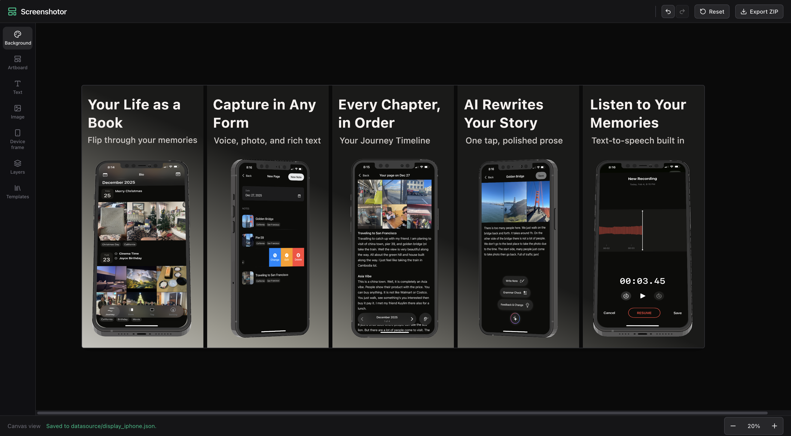

# apps_publisher

**Main purpose:** This project is built **for developers** — app engineers and publisher workflows who need repeatable, scriptable control over store screenshots, not a consumer-facing design product.

**apps_publisher** is an open-source toolkit for designing and automating **App Store** and **Play Store** screenshot layouts. A screenshot set is one HTML document — a **strip** — that a visual editor and a headless renderer both read. Edit it in the browser, hand it to an agent, or both at once; it stays a file in your repo either way.

## Demo
Design by Human! 🧑🏽‍💻 ~ 5 minutes (continue from AI) <br><br>


Design by Claude! 🤖 ~ 17 minutes <br><br>
[](https://www.youtube.com/watch?v=NJOYo_1MTBE)

## The editor

The **[`strip_editor/`](strip_editor/)** (port 4714) opens a strip HTML file directly — no import step, no conversion, no second representation. It reads the file, edits it visually, and saves it back in place.

- **Store-sized panels** — Panels are authored at the exact export size of the target preset (e.g. 1290×2796 for iPhone portrait). **New strip** picks a device target and a panel count, then scaffolds a blank, schema-conformant document at `strips/<device>/strip.html` — the folder and the panel size both follow from the device, so there is no name to invent.
- **Four layer kinds** — text, device, image, decor. Select, move, resize and restyle any of them; the layer tree is built from the `data-layer` attributes in the file.
- **Device mockups** — SVG frame packs, each with one or more poses; real app screenshots are warped into the screen opening by homography and clipped to the pose's screen mask. What is available is whatever `composer/device-frames/` contains — see its [README](composer/device-frames/README.md).
- **Agent-aware** — When something else writes the file, the editor reloads and puts itself in read-only agent mode, with a lease that lapses shortly after the last write. So an agent running the `strip-design` skill can design while you watch. See [The design skill](#the-design-skill).

## What it does

- **One document per strip** — Every panel of a screenshot set lives in a single HTML file. It is the source of truth: the renderer exports it and the editor edits it, in the same browser engine.
- **Real export sizes** — Panels are authored at store dimensions, so what you see is what ships; `render.mjs` also reports measured geometry and a list of layout `problems`.
- **Agent integration** — One skill, `strip-design`. An agent authors or edits the strip HTML, renders it to PNGs with Playwright, looks at the result, and iterates.

The repo is intended for **local development**: run the Vite dev server, open a strip in the editor, and edit it by hand or let an agent edit the same file.

## Repository layout

| Path | Role |
|------|------|
| [`strip_editor/`](strip_editor/) | **Strip editor** — Vite + React editor (port 4714). Opens a strip HTML file at `?strip=<repo-relative path>`, watches it on disk, and reloads when anything else writes it. |
| [`composer/`](composer/) | **HTML-first strip composer** — strips are authored as HTML/CSS ([`strip-schema.md`](composer/strip-schema.md)); `render.mjs` exports store-size PNGs + a `strip-data.json` snapshot (measured geometry + `problems`) via Playwright; `check-schema.mjs` checks structure from source text, no browser. |
| [`.claude/skills/`](.claude/skills/) | **The skill** — [`strip-design`](.claude/skills/strip-design/SKILL.md), the one agent-facing entry point. No agents, no helper scripts. |
| [`input/`](input/) | **The brief.** `app.md` (app name, summary, tone, theme, and — optionally — the copy for each panel) plus the app's screen captures. The design run starts here and refuses to start without it. Give it only a description and it drafts the panel copy, writing it back into `app.md`. |
| [`strips/`](strips/) | **The strips.** One folder per device target (`iphone`, later `ipad` / `phone` / `tablet`): `strip.html`, `images/`, `screenshots/`, and a gitignored `rendered/`. Everything a design references lives with it — move the folder and it still renders. |
| [`mask_analysis/`](mask_analysis/) | **Standalone** browser tool to analyze SVG device-frame screen masks and composite screenshots with OpenCV.js (no npm build). |

## Architecture

```text
┌─────────────────────────────────────────────────────────────────┐
│                       apps_publisher (repo)                      │
├──────────────────────────────┬──────────────────────────────────┤
│  strip_editor (Vite :4714)   │  composer (Node + Playwright)    │
│  • opens a strip HTML file   │  • render.mjs   — strip → PNGs   │
│  • watches it on disk        │    + strip-data.json (geometry,  │
│  • reloads on outside writes │      problems)                   │
│  • saves back in place       │  • check-schema.mjs — structure, │
│                              │      source text, no browser     │
└──────────────┬───────────────┴──────────────┬───────────────────┘
               │      the same HTML file       │
               └──────────────┬────────────────┘
                              ▼
                     strips/<device>/
                       strip.html
                       images/ · screenshots/ · rendered/
```

The whole thing is a pipeline with one input and one output:

```text
input/                     strips/<device>/
  app.md          ──────▶    strip.html
  welcome.jpg      design     images/ · screenshots/ · rendered/
  transfer.jpg …
```

The strip folder is named for the **device target** — `strips/iphone/` today,
with `ipad`, `phone` and `tablet` beside it as those targets are added. One
`input/` describes one app; each folder under `strips/` is that app's output for
one device. It is **output**: change the input, run again, and that folder is
replaced by the new result.

There is no canvas, no importer and no second representation — one HTML
document per strip, read by both programs.

**The design loop:**

0. Read [`input/app.md`](input/) and the captures beside it. No input, no run.
   Draft any panel copy the file does not already have, and write it back there.
1. Read the strip and [`composer/strip-schema.md`](composer/strip-schema.md).
2. Edit the HTML (real screenshots warped into device frames via `frame.json` homography).
3. `node composer/check-schema.mjs strips/<device>/strip.html` — structural check, no browser, costs nothing.
4. `node composer/render.mjs --strip strips/<device>/strip.html --full` — export-size PNGs + `strip-data.json`, into `rendered/` beside the strip.
5. Read the `problems` array first, then look at the PNGs against [`composer/references/`](composer/references/). Iterate.

## The design skill

One skill: **[`strip-design`](.claude/skills/strip-design/SKILL.md)** in
[`.claude/skills/`](.claude/skills/). There are no agents and no helper scripts
— the agent surface is that single file.

It covers both cases, because they are the same job: a blank strip created with
the editor's **New strip** button, and an existing strip that needs a specific
change. It holds the layer contract's easiest mistakes, the render loop above,
the review step, and the design craft notes.

Ask for it by name, or just point at a strip and say what you want changed. If
the editor is open on the file, each write reloads the canvas, so the design
appears as it is made.

## Quick start

### 1. Strip editor (visual editing)

```bash
cd strip_editor
npm install
npm run dev
```

Open a strip at **http://localhost:4714/?strip=strips/&lt;device&gt;/strip.html**, or use the landing screen. It shows the four device targets — `iphone`, `ipad`, `phone`, `tablet` — whether or not they exist: click one that does to open it, one that does not to create a blank strip there, or **Load strip** to copy a strip folder in from anywhere on disk. The editor reads and writes that file in place, and reloads it when anything else — you, or an agent — writes to it.

**Load measures rather than asks.** A folder's panel size decides where it lands — 1290×2796 goes to `strips/iphone/` — and the strip is run through `check-schema.mjs` once it is in place; if it fails, whatever was there before is put back.

Creating never overwrites: if `strips/iphone/` already exists the editor says so and leaves it alone. Loading over it asks first. A **design run does** replace it without asking, though — a strip you build by hand here is not protected from the next run of the skill, so copy the folder elsewhere if it is worth keeping.

### 2. Composer (HTML renderer)

```bash
cd composer
npm install
npx playwright install chromium
```

Details: [`composer/README.md`](composer/README.md)

### 3. Mask analysis (optional)

Static tool for tuning perspective screen quads on SVG device frames:

```bash
cd mask_analysis
python3 -m http.server 8080
# open http://localhost:8080
```

Details: [`mask_analysis/README.MD`](mask_analysis/README.MD)

## Requirements

| Component | Requirement |
|-----------|-------------|
| **composer** | Node.js **22.x**, npm, Playwright Chromium |
| **strip_editor** | Node.js **22.x**, npm; dev server on port **4714** |
| **mask_analysis** | Any static HTTP server; network for OpenCV.js CDN on first load |

## Documentation map

| Topic | Location |
|-------|----------|
| Editor setup, keys & HTTP API | [`strip_editor/README.md`](strip_editor/README.md) |
| Strip layer contract | [`composer/strip-schema.md`](composer/strip-schema.md) |
| The design skill | [`.claude/skills/strip-design/SKILL.md`](.claude/skills/strip-design/SKILL.md) |
| Strip folder layout | [`composer/strip-schema.md`](composer/strip-schema.md) — *Where a strip lives* |
| Writing the brief (`input/app.md`) | [`input/README.md`](input/README.md) |
| Device frame packs & pose sizing | [`composer/device-frames/README.md`](composer/device-frames/README.md) |
| HTML strip composer | [`composer/README.md`](composer/README.md) · [`composer/strip-schema.md`](composer/strip-schema.md) |
| SVG screen mask tool | [`mask_analysis/README.MD`](mask_analysis/README.MD) |

## Development notes

### What git tracks

**Neither `input/` nor `strips/` is tracked** — only `input/README.md`, which
documents the format. Your brief, your app's captures and the strips made from
them are working data, not repository content; the repo holds the tools.

Worth knowing, because it does not apply to an ordinary build: **a run is not
deterministic.** The agent makes the design decisions — layout, poses, palette,
crops — and none of them live in `input/`, so re-running the same input gives
you a *different* strip rather than the same one back. Nothing here is
recoverable: if a design is worth keeping, copy the folder somewhere outside the
repo. The same goes for anything you hand-tuned in `strip_editor`, which exists
only in the strip.

Nothing clears these folders for you.

### Tooling

- **Tests** — `cd composer && npm test` · `cd strip_editor && npm test`
- **Structural check** — `node composer/check-schema.mjs --all`

This is built for **`npm run dev`** workflows, not as a hosted production app.

## Contributing

Issues and pull requests are welcome.

**Code & automation** — When changing the strip contract or the composer CLIs, update [`composer/strip-schema.md`](composer/strip-schema.md) and keep [`.claude/skills/strip-design/SKILL.md`](.claude/skills/strip-design/SKILL.md) aligned. The schema is the contract; the skill only points at it.

**Device frames (especially welcome)** — The catalog is small today (see [`composer/device-frames/`](composer/device-frames/)). Contributors who can supply **device mockup packs** are a big help. We are looking for:

| Contribution | Examples |
|--------------|----------|
| **Different devices** | More iPhone / iPad models, Android phones and tablets, other form factors |
| **Different angles** | Front, slight Y-axis rotation (`angled-left` / `angled-right`), tilted views |
| **Different edges** | Frames that show left/right/top/bottom bezels and buttons, not only a flat front |
| **Different isometric / 3D-style views** | e.g. `isometric-left`, `isometric-right`, and other perspective variants |
| **More variants per device** | Several SVG styles per pack so layouts can mix poses on one artboard |

Please use **original or properly licensed** artwork only, and include a short note in the PR describing the device model and which angles/edges each SVG represents. OR send to my email directly [sovannmeasna.ly@gmail.com](mailto:sovannmeasna.ly@gmail.com).

## License

This project is licensed under the [MIT License](LICENSE).
